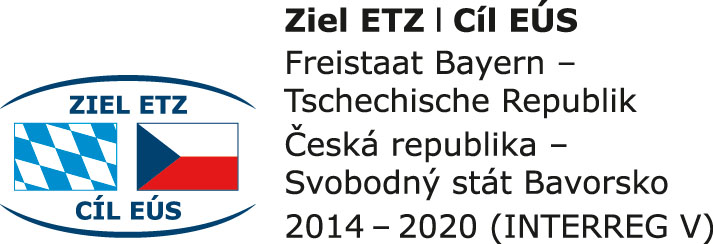

## ICDAR 2019 Writer Identification Competition:

### Install:
```bash
pip install --user --upgrade git+https://github.com/anguelos/dagtasets
```

### Submission Format

Submissions must be in csv form as [here](https://github.com/anguelos/wi19_evaluate/blob/master/test_data/test_leaderboard/team_1/0004200862.csv).
* No header row.
* For N samples (image files),
* N rows
* N+1 or N+2 columns
* The relevance column is optional and is required to estimate classification metrics.
* No quoted values
* Sample names should be the filenames of each image.

| Sample Name   | Relevant Estimate   | Sample1   | Sample2   | Sample3   |
| ------------- |:-------------------:|:---------:|:---------:|:---------:|
| s1.jpg        | 1                   | 0.0       | 0.7       | 0.9       |
| s2.jpg        | 2                   | 0.7       | 0.0       | 1.9       |
| s3.jpg        | 2                   | 0.9       | 1.9       | 0.0       |


### Evaluate:
```bash
#print help
./bin/wi19evaluate -h
# on run data:
./bin/wi19evaluate -submission_csv=dm.csv -gt_csv=gt.csv 
``` 
 
### Leaderboard:
[curent leaderboard](https://anguelos.github.io/wi19_evaluate/)


```bash
#!/bin/bash

GITROOT="/home/anguelos/work/src/wi19_evaluate/"
OUTPUT_ROOT="${GITROOT}/docs/"
USER_DIRS="/home/anguelos/work/src/wi19_evaluate/test_data/test_leaderboard/team*"
GROUNDTRUTH='/home/anguelos/work/src/wi19_evaluate/test_data/test_leaderboard/gt.csv'
INCOMING_ROOT='/home/anguelos/work/src/wi19_evaluate/test_data/test_leaderboard/incoming/'

for FILE_IN in "${INCOMING_ROOT}"team_*/*.csv;
do
    FILE_MOVE="$(echo $FILE_IN| sed 's/incoming//g' )"
    FILE_MOVE="${FILE_MOVE%.*}_$(date +'%Y%m%d%H%M').csv"
    echo "mv ${FILE_IN} ${FILE_MOVE}";
done

"${GITROOT}bin/wi19leaderboard" \
       "-output_root=${OUTPUT_ROOT}"  \
       "-user_dirs=${USER_DIRS}"   \
       "-gt_csv=${GROUNDTRUTH}"


cd ${GITROOT}
git  add docs/index.html docs/svg/*.svg
git  commit -m "Auto Update"
git  push
```

## Acknowledgement:

Development for this tool has been supported by the European project 211 "Modern access to historical sources" a Cross-border cooperation program
Free State of Bavaria and the Czech Republic.


<table><tr><td>

</td><td>

</td></tr><table>
